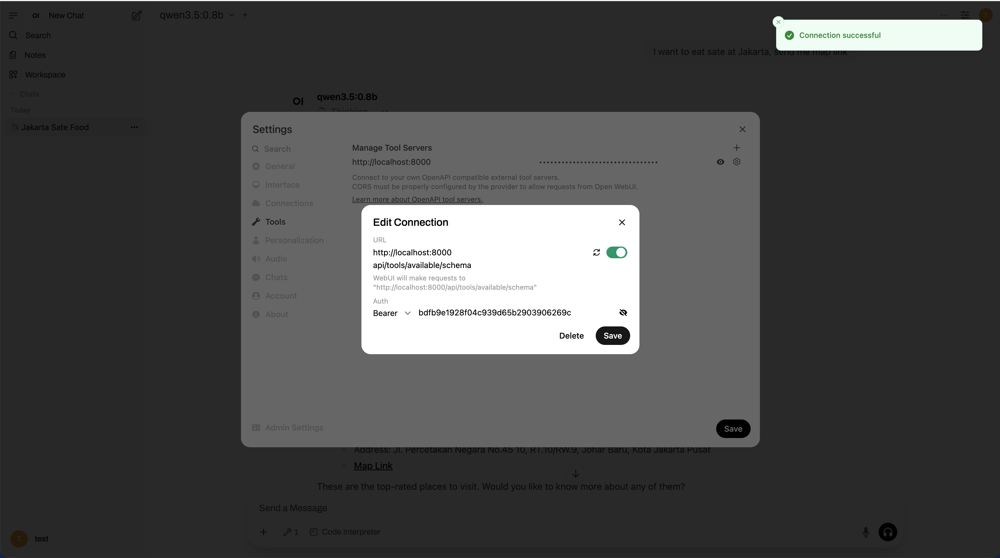
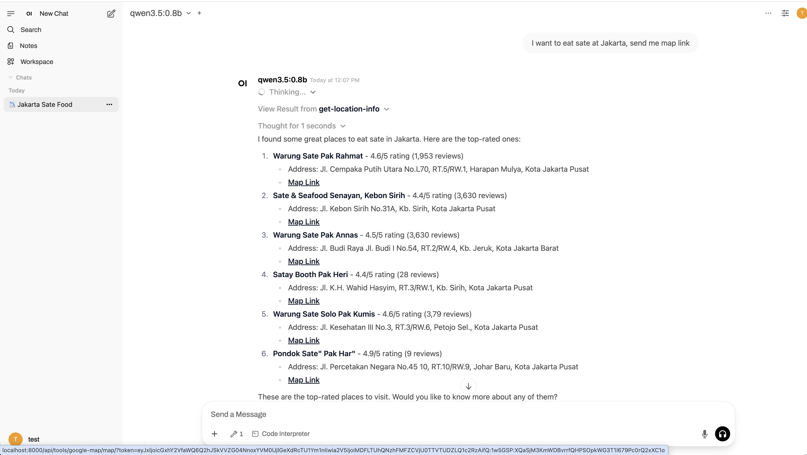

# Test HeyPico (Django + DRF + drf-spectacular)

A modern Django-based API platform featuring a dynamic "API Tools" integration framework, custom token-based authentication with fine-grained permissions, and built-in support for Redis-backed rate limiting and signed URLs.

## 🚀 Features

- **Custom Token Authentication:** Secure access using ULID-based `AccessToken` with built-in rate limiting and expiration.
- **API Tools Framework:** A registry-based system for dynamically mounting 3rd-party integrations (e.g., Google Maps).
- **Fine-grained Permissions:** Tool-level access control via the `AccessPermission` model.
- **Scoped OpenAPI Schemas:** Dynamically generated OpenAPI specs tailored to the specific permissions of the authenticated token.
- **Google Maps Integration:** Ready-to-use search and geocoding services with simplified Markdown output and signed map links.
- **Utility Suite:**
    - **Redis Rate Limiting:** Fixed-window rate limiting per second.
    - **Signed URLs:** Tamper-proof URL generation for secure, temporary links.
- **Modern Tech Stack:** Python 3.12+, Django 6.0, DRF, ULIDs for primary keys, `uv` for package management, and Docker orchestration.

---

## 🛠️ Requirements

- **Python 3.12+**
- **[uv](https://docs.astral.sh/uv/)**
- **Docker & Docker Compose (v2)**
- **Redis** (Required for rate limiting)
- **Google Maps API Key** (Optional, for Google Map integration)

---

## 1) Local Setup with `uv`

### Install dependencies
```sh
uv sync
```

### Environment Configuration
Create a `.env.docker` file in the project root and copy the following content on .sample.env.docker:
```sh
# NOTE:
GOOGLE_MAPS_API_KEY=your-google-maps-key # Note: this is need valid api key for google map integration to work
```

### Run database migrations (SQLite)
```sh
uv run python manage.py migrate
```

### Start development server
```sh
uv run python manage.py runserver
```
The app will be available at `http://127.0.0.1:8000/`.

---

## 2) API Architecture & Endpoints

### Authentication
The project uses a custom `Bearer` token authentication scheme.
- **Header:** `Authorization: Bearer <your_access_token>`
- **Token Model:** `AccessToken` (includes `rate_limit`, `expires_at`, and `is_active`).

### API Tools Registry
All integrations are mounted under `/api/tools/`. The available tools are defined in the `AccessPermission` enum and registered in `app/api_tools/registry.py`.

#### Core Endpoints:
- **Health Check:** `GET /api/health/`
- **Global Schema:** `GET /api/schema/` (Full API documentation)
- **Swagger UI:** `GET /api/docs/`
- **List All Tools:** `GET /api/tools/list/` (Names of all possible integrations)
- **My Available Tools:** `GET /api/tools/available` (Integrations permitted for the current token)
- **My Scoped Schema:** `GET /api/tools/available/schema` (OpenAPI spec filtered by token permissions)
- **Tool Schema:** example `GET /api/tools/google-map/connect/ or /api/tools/my-other-api/connect/ etc` (the main idea is to show how we can generate openapi schema for specific tool)

---

## 3) Containerized Setup (Docker Compose)

### Environment file for Docker
Create `.env.docker` based `.sample.env.docker` with the following content
```sh
# Note: this is need valid api key for google map integration to work
GOOGLE_MAPS_API_KEY=your-google-maps-key
```


### Build and start containers
Run using docker compose dev, initial data is automatically loaded to the database
```sh
docker compose -f docker/docker-compose.yml -f docker/docker-compose.dev.yml up
```

### intial data for docker-compose.dev
User Account for login to admin panel `htpp://localhost:8000/admin`
```
email: test@test.com
password: test
```

Access Token and permission for Open WebUI Tool Servers configuration
```
URL: http://localhost:8000/api/tools/available/schema
Auth: Bearer bdfb9e1928f04c939d65b2903906269c
```

---

## 4) Key Components & Utilities

### Authentication & Permissions (`app/auth`)
- **Custom User:** Uses `ULID` as primary keys for better scalability and sortable IDs.
- **HasAccessPermission:** A DRF permission class that verifies if a token has the specific `AccessPermission` required for a tool.

### Common Utilities (`app/common/utils`)
- **RateLimit:** `RateLimit.has_rate_limit(key, limit)` provides Redis-backed throttling.
- **SignedURL:** `SignedURL.generate_token()` and `verify_token()` use Django's cryptographic signing to prevent URL tampering.
- **RedisClient:** Centralized Redis connection management.

### Google Map Integration (`app/api_tools/integrations/google_map`)
- **Search:** `GET /api/tools/google-map/` - Search for nearby places with geocoding.
- **Output:** Returns both raw data and a pre-formatted `content` field (Markdown) for easy integration with frontend/LLMs.
- **Map Links:** Generates secure, signed URLs for viewing locations on maps.

---

## 📂 Project Structure

```text
test-heypico/
├── app/
│   ├── auth/          # Custom User, AccessToken, and Permission logic
│   ├── api_tools/     # Integration framework & tool registry
│   │   └── integrations/ # Individual tool implementations (Google Maps, etc.)
│   └── common/        # Shared utilities (Rate limiting, Redis, Signed URLs)
├── config/            # Django settings, URLs, and ASGI/WSGI config
├── docker/            # Docker Compose and Dockerfile configurations
├── manage.py          # Django management script
├── pyproject.toml     # uv/Python project metadata
└── uv.lock            # Deterministic lockfile
```

---

## 🧪 Testing

Run the test suite using `uv`:
```sh
uv run python manage.py test
```

Specific integration tests:
```sh
uv run python manage.py test app.api_tools.integrations.google_map.tests
```


---

## Demo

#### 1. Add API Tool Server in Open WebUI



#### 2. Tool calling test with Google Map API Tool - Get Location Info API



## 📝 Notes
- **Database:** Uses SQLite by default (For demo purposes). For production, switch to PostgreSQL or another robust database.
- **Caching/Rate Limiting:** Requires a running Redis instance.
- **API Security:** Only access tokens with the appropriate `AccessPermission` can access specific tools. also have rate limit and optional expiration time for better security and abuse prevention.
- **GOOGLE_MAPS_API_KEY** is required for the Google Maps integration to function properly. on production, ensure to limit the API key scope permission scope, usage to your domain or IP for security. for this demo, we use the same key for both ( could be configured separately for better security).
- **SignedURL Security:** the cryptographic signed urls implementation is used for show google map embed link with time window and rate limit (per second), the settings can be configured using environtment variable `SIGNED_URL_RATE_LIMIT` and `SIGNED_URL_MAX_AGE`
- **Open WebUI issue:**, if I added API tool servers with the same domain, the Open Web UI only can call the tools form the first added tool server while other tool server was added and connected successfully. so I recomended just using 1 tool server with same host url for now.
- **Get Location Info API Output:** for demonstration purposes, I have `content` and `data` field in response. `content` is the pre-formatted markdown string for easy integration with frontend or LLMs, while `data` is the raw response data. In production, you can choose to return the API response with only one of them based on your use case.
- **Logger** I didn't handle this in this demo since want to focus on the api tool integration. In production, you should have a proper logger for better debugging and monitoring. you can use Python's built-in `logging` module or integrate with third-party services like Sentry, Logstash, etc.
